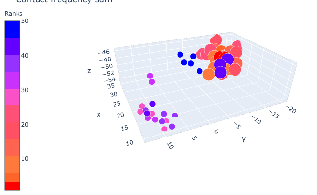
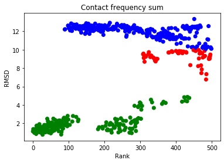

```python
import sys
import os
PATH_TO_LOCAL_REPO="/Users/jprieto/DockingPP"
sys.path.append(PATH_TO_LOCAL_REPO)
from dockingPP import zParse
from src.core_scores import multiplePlots
%load_ext autoreload
from copy import copy
```

### Generate Dock Data object From ZDOCK files


```python
%autoreload 2
zD=zParse(PATH_TO_LOCAL_REPO+"/example_data/ZDOCK_examples/1BJ1.out", maxPose=500)
zD.setReceptor(PATH_TO_LOCAL_REPO+"/example_data/ZDOCK_examples/1BJ1_r_u.pdb")
zD.setLigand(PATH_TO_LOCAL_REPO+"/example_data/ZDOCK_examples/1BJ1_l_u.pdb")
zD.setComplexName("1BJ1")
```

### Import rmsds from external file in ZDOCK-like format


```python
zD.loadRMSD(filename=PATH_TO_LOCAL_REPO+"/example_data/ZDOCK_examples/1BJ1.rmsds")
```


    True


### Compute Contactmap for each pose


```python
zD.ccmap(start=0, stop=500, pSize=10)
```

    Created 50 data packets (10 zObjects each) for process pool
    unpacking


### Analyse poses and obtain scores


```python
zD.setScores()
# scores are available at 
scores=zD.scores
```

### Get scores for a given pose 


```python
print(zD.pList[0].scores)
```

    {'original_rank': 1, 'r_size': 57, 'res_fr_sum': 34.586, 'res_mean_fr': 0.6067719298245614, 'res_log_sum': -35.13188173524741, 'res_sq_sum': 24.845604000000005, 'c_size': 94, 'con_fr_sum': 16.688375999999995, 'con_mean_fr': 0.17753591489361698, 'con_log_sum': -173.4957554528565, 'con_sq_sum': 3.5713095055040007}


### Use rescoring functions to rearrange poses' order
Available rescoring functions are 
 - "original_score" : initial order from scoring function
 - "r_size" : number of residues in contact in interface
 - "res_fr_sum" : residues' frequency sum
 - "res_mean_fr" : residues' frequency mean value
 - "res_log_sum" : residues' log(frequency) sum
 - "res_sq_sum" : residues' frequency<sup>2</sup> sum
 - "c_size" : number of contacts between residues in interface
 - "con_fr_sum" : contacts' frequency sum
 - "con_mean_fr" : contacts' frequency mean value
 - "con_log_sum" : contacts' log(frequency) sum
 - "con_sq_sum" : contacts' frequency<sup>2</sup> sum


```python
zD.rankedPoses(element="con_fr_sum", start=0, stop=10)
```


    [1) (-2.3387043048467024, 0.0877660312067456, 2.5892605659497265) (30.0, -14.399999999999999, -50.4),
     9) (-2.0009782416802335, 0.19220052712899582, 2.1858633717121037) (31.2, -15.6, -49.199999999999996),
     5) (-1.0908638889462818, 0.127485129156887, 1.1695390693224217) (28.799999999999997, -14.399999999999999, -51.6),
     2) (0.16057090936250432, 0.03341704129736545, 0.0168032252968433) (27.599999999999998, -13.2, -52.8),
     3) (0.055850909362502324, 0.03341704129736545, 0.0168032252968433) (26.4, -14.399999999999999, -52.8),
     7) (-2.1056982416802335, 0.19220052712899582, 2.1858633717121037) (30.0, -18.0, -49.199999999999996),
     10) (-3.082004870984042, 0.1696747547453455, -2.8753304406779834) (28.799999999999997, -15.6, -51.6),
     8) (-1.3505746727262768, 0.2002869797238684, -1.5106441284114913) (13.2, 10.799999999999999, -54.0),
     6) (2.8724760031747043, 2.4330632335825055, -2.827461246420031) (9.6, 8.4, -54.0),
     4) (-0.07815321597227459, 2.2831535556249776, -1.5440776532022715) (21.599999999999998, -1.2, -46.8)]


```python
zD.rankedRmsds(element="con_fr_sum", start=0, stop=10)
```


    [1.38, 1.32, 0.98, 0.98, 0.85, 1.05, 1.72, 12.59, 12.41, 11.26]


### Visualize this new ranking 
In 3D : hover on each pose to see it's detail


```python
zD.plot3D(element="con_fr_sum", name="1BJ1", title= "Contact frequency sum")
```



```python
print(zD[5].translate)
```

    (9.6, 8.4, -54.0)


### Evaluate the success of your rescoring Method 


```python
# zD.rmsdPlot(element="con_fr_sum", title="Contact frequency sum")
```


```python
zD.countNatives(element="res_fr_sum", cutoff=2.5) 
```


    {5: 0, 10: 0, 20: 0, 100: 9, 200: 41, 'out': 105}


*Oh, it didn't wortk : no good solution in first 10 !* 

### Now let's try some clustering 


```python
%autoreload 2
clusters=zD.BSAS(3) ## returns clusterCollection object
```


```python
print(clusters.size) ## Number of clusters
print([ clus.size for clus in clusters]) # number of poses in each cluster 
print(clusters[1].bounds) ## Minimum and maximum coordinates in cluster ([xmin,xmax],[ymin,ymax],[zmin,zmax])
```

    103
    [37, 19, 39, 15, 16, 19, 16, 11, 15, 12, 10, 6, 9, 16, 9, 12, 4, 16, 4, 6, 8, 6, 8, 3, 3, 7, 5, 10, 5, 3, 6, 4, 2, 4, 3, 2, 3, 1, 3, 6, 7, 7, 3, 3, 1, 1, 4, 2, 1, 3, 1, 3, 2, 3, 3, 2, 1, 3, 1, 1, 5, 2, 2, 2, 1, 1, 2, 1, 1, 3, 3, 3, 3, 1, 1, 1, 1, 1, 1, 1, 1, 1, 1, 2, 1, 1, 1, 1, 1, 2, 1, 1, 2, 2, 1, 1, 1, 2, 1, 1, 2, 1, 1]
    ([27.599999999999998, 32.4], [-16.8, -12.0], [-52.8, -48.0])


 *103 clusters have been created containing from 1 to 12 poses*

### Sort and filter clusters based on size, scores


```python
sor_clusters=clusters.sorted(min_size=10)
print(len(sor_clusters))
```

    15


*Only 15 clusters left after trimming*


```python
print([(p.id,p.rmsd) for p in clusters.representatives(element="res_fr_sum", min_size=10)])
# print([p.id for p in clusters.representatives(min_size=2)]) 
```

    [(14, 12.53), (25, 12.26), (8, 12.59), (55, 12.4), (20, 12.7), (6, 12.41), (50, 12.4), (4, 11.26), (1, 1.38), (17, 1.77), (119, 2.14), (2, 0.98), (30, 1.35), (7, 1.05), (18, 0.95)]


```python
clusters.countNatives(clusters.representatives(element="res_fr_sum", min_size=10), cutoff=2.5)
```


    {5: 0, 10: 2, 20: 7, 100: 7, 200: 7, 'out': 0}


*Clustering helped !* 

### Visualize your clusters or your chosen poses using plotFromPoses() 


```python
zD.plotFromPoses(clusters.representatives(element="res_fr_sum", min_size=10))

```


